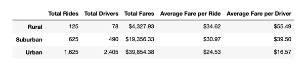

# PyBer_Analysis
Analyze and visualize ride-sharing data using the power of **Python, Pandas, and Matplotlib**.

## Steps
Use **Python** and **Matplotlib library** to graph data in a dataframe.

1. Create *line, bar, scatter, bubble, pie, and box-and-whisker* plots using **Matplotlib**.
2. Add and modify features of Matplotlib charts.
3. Add *error bars* to line and bar charts.
4. Determine mean, median, and mode using **Pandas, NumPy, and SciPy** statistics.

## Discussion
Create a summary table for the ride-sharing data per city type, and a multiple-line graph that shows the average fare per week by each city type by utilizing **Python** as well as the **Pandas and Matplotlib libraries** in **Jupyter Notebook**. 

1. *Total Rides*: It's not surprising that Urban total rides (1625) are more than Suburban total rides (625), and Suburban total rides are more than Rural total rides (125).

2. *Total Drivers*: Same as Total Rides, Urban total drivers (2405) are more than Suburban total drivers (490), and Suburban total rides are more than Rural total rides (78).

3. *Total Fares*: Similarly, Urban total fares ($39,584) are more than Suburban total fares ($19,356), and Suburban total fares are more than Rural total fares ($4,328).

4. *Average Fare per Ride*: However, since Urban has way more than rides, the average fare per ride for Urban ($24.53) is less than Suburban ($30.97), and Suburban is less than Rural ($34.62).

5. *Average Fare per Driver*: Similarly, due to more drivers in Urban, the average fare per driver for Urban ($16.57) is less than Suburban ($39.50), and Suburban is less than Rural ($55.49).

6. *Sum of Fare*: From the multiple-Line chart, Urban has the most sum of fare, then Suburban, and lastly Rural. Besides that, it seems the difference between them stays almost the same over time. 

---
The code is in [`PyBer_Challenge.ipynb`](https://github.com/plin2204/PyBer_Python/blob/master/PyBer_Challenge.ipynb).
